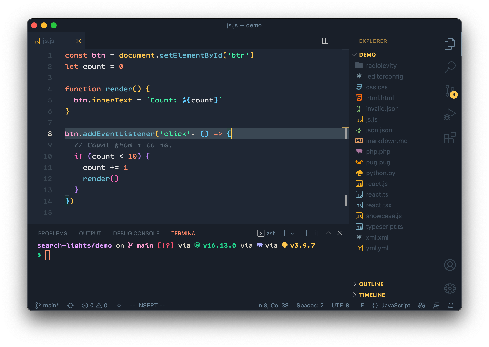

# Search Lights 🌄

---

Based on the lovely [Field Lights](https://marketplace.visualstudio.com/items?itemName=sveggiani.vscode-field-lights), with cooler, more pastel highlighting modified from [Panda Syntax](https://marketplace.visualstudio.com/items?itemName=tinkertrain.theme-panda).

Want something a little warmer? Try my new theme [Head in the Clouds](https://marketplace.visualstudio.com/items?itemName=radiolevity.head-in-the-clouds).

## Recommendations

**Font:** [Ellograph](https://connary.com/ellograph.html) or [Cascadia Mono](https://github.com/microsoft/cascadia-code) with cursive italics

**Icon Theme:** [Ayu](https://marketplace.visualstudio.com/items?itemName=teabyii.ayu)

**Settings:** `"editor.bracketPairColorization.enabled": true`

Cheers!

_search and rescue icon by Ásgeir Vísir from the Noun Project_
